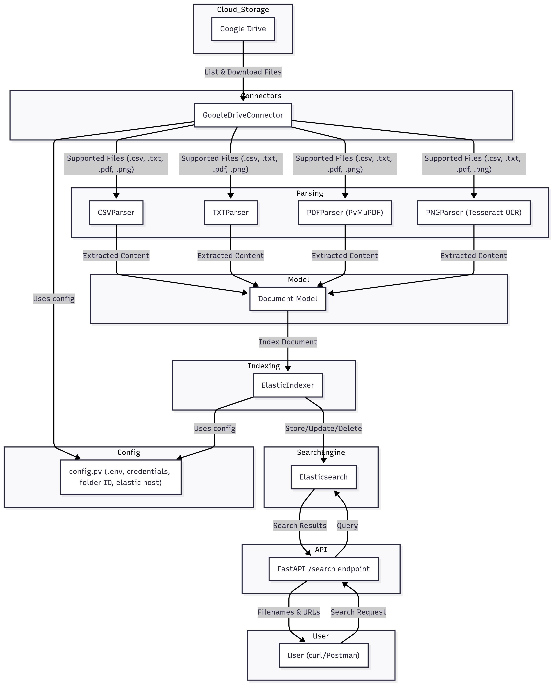

# Cloud Document Search

## Overview
This application connects to Google Drive, fetches documents (.csv, .txt, .pdf, .png), extracts their content, indexes them in Elasticsearch, and provides a search API to find documents by content or metadata.

## Features
- Connects to Google Drive and fetches supported files
- Extracts text from CSV, TXT, PDF, and PNG (OCR) files
- Indexes content and metadata in Elasticsearch
- Provides a REST API for searching documents
- Returns file names and URLs for matching documents

## Installation

1. **Clone the repository:**
   ```bash
   git clone https://github.com/TheAIExplorer/gbm-document-search.git
   ```
2. **Install dependencies:**
   ```bash
   pip install -r requirements.txt
   ```
3. **Install Tesseract (for OCR):**
   - Windows: Download from https://github.com/tesseract-ocr/tesseract
   - Linux: `sudo apt-get install tesseract-ocr`
   - Mac: `brew install tesseract`
4. **Set up Google Drive API credentials:**
   - Follow https://developers.google.com/drive/api/quickstart/python to get `credentials.json`.
   - Place it in the project directory.
5. **Configure settings:**
   - Edit `utils/config.py` to set `CREDENTIALS_FILE`, `GDRIVE_FOLDER_ID`, and `ELASTIC_HOST`.
6. **Start Elasticsearch:**
   - Run from the provided directory or install separately.
7. **Run the API server:**
   ```bash
   uvicorn api.search_api:app --reload
   ```

## Elasticsearch Setup

This project requires a running Elasticsearch instance.

### Option 1: Download and place in root directory and Run Manually
- Download Elasticsearch from [https://www.elastic.co/downloads/elasticsearch](https://www.elastic.co/downloads/elasticsearch)
- Extract and run:
  - **Windows:**
    ```
    bin\elasticsearch.bat
    ```
  - **Linux/Mac:**
    ```
    bin/elasticsearch
    ```

### Option 2: Use Docker
If you have Docker installed, you can run:
```bash
docker run -p 9200:9200 -e "discovery.type=single-node" docker.elastic.co/elasticsearch/elasticsearch:8.13.4
```

### Configuration
- Make sure your `.env` or `ELASTIC_HOST` in `utils/config.py` points to your running Elasticsearch instance (default: `http://localhost:9200`).

## Usage

### Indexing Documents
- Use the GoogleDriveConnector and document parsers to fetch and index documents. (See code in `main.py` or create a script to automate this.)

### Search API
- Example search query:
  ```bash
  curl "http://127.0.0.1:8000/search?q=example"
  ```
- **Response:**
  ```json
  [
    {"filename": "File1.pdf", "url": "https://drive.google.com/..."},
    {"filename": "File2.txt", "url": "https://drive.google.com/..."}
  ]
  ```

### Handling File Deletion
- If a file is deleted from Google Drive, re-run the indexing script to sync and remove it from Elasticsearch.

### File Deletion Sync
- When you run the indexing script (`python main.py`), any files deleted from Google Drive will be automatically removed from the Elasticsearch index. No manual cleanup is required.

## High-Level Design Diagram




## Notes
- Ensure Tesseract is installed and available in your PATH for OCR to work.
- For demo, use Postman or curl to hit the `/search` endpoint.
- For other cloud providers, implement a connector similar to `google_drive.py`.

## API Demo: Postman Collection & CLI Example

### Postman Collection
```json
{
  "info": {
    "_postman_id": "cloud-doc-search-collection",
    "name": "Cloud Doc Search API",
    "schema": "https://schema.getpostman.com/json/collection/v2.1.0/collection.json"
  },
  "item": [
    {
      "name": "Search Documents",
      "request": {
        "method": "GET",
        "header": [],
        "url": {
          "raw": "http://localhost:8000/search?q=example",
          "protocol": "http",
          "host": ["localhost"],
          "port": "8000",
          "path": ["search"],
          "query": [
            {"key": "q", "value": "example"}
          ]
        }
      },
      "response": []
    }
  ]
}
```

### CLI Example
```bash
curl "http://localhost:8000/search?q=example"
```
